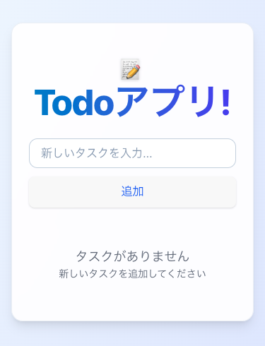

[](https://todoapp-1758903137.web.app)

# Todo アプリ (CI/CD ポートフォリオ)

軽量な Todo アプリ を題材に、Vite + React + TypeScript + Tailwind CSS で実装し、GitHub Actions → Firebase Hosting へ 自動ビルド & 自動デプロイ を構築したポートフォリオです。

リポジトリ: https://github.com/takkami/todo-cicd

本番 URL: https://todoapp-1758903137.web.app

<p align="center">
  <picture>
    <source media="(prefers-color-scheme: dark)" srcset="docs/screenshots/dark-pc.png" />
    
  </picture>
</p>
<p align="center">
  <picture>
    <source media="(prefers-color-scheme: dark)" srcset="docs/screenshots/dark-sp.png" />
    
  </picture>
</p>

## 目次

- [特長](#特長)
- [技術スタック](#技術スタック)
- [ローカル開発](#ローカル開発)
- [テスト](#テスト)
- [CI/CD 構成](#cicd-構成)
- [Firebase セットアップ](#firebase-セットアップ)
- [スクリーンショットの管理](#スクリーンショットの管理)
- [アクセシビリティ / パフォーマンス](#アクセシビリティ--パフォーマンス)
- [フォルダ構成](#フォルダ構成)
- [ライセンス](#ライセンス)
- [著者 / コントリビュート](#著者--コントリビュート)

## 特長

✅ Tailwind CSS によるモダン UI（ライト/ダーク自動対応、レスポンシブ）

✅ 未入力でも ボタン色は青系の見た目を維持（機能は無効）

✅ GitHub Actions による CI（型チェック・ビルド・テスト・本番軽量検証）

✅ Firebase Hosting に自動デプロイ

✅ Vitest + React Testing Library のテスト収録

## 技術スタック

- **App**: Vite / React / TypeScript / Tailwind CSS
- **Test**: Vitest / @testing-library/react
- **CI/CD**: GitHub Actions
- **Hosting**: Firebase Hosting

## ローカル開発

```bash
# 1) 依存関係
npm ci   # or: npm install

# 2) dev サーバー
npm run dev
# → http://localhost:5173

# 3) 本番ビルド
npm run build    # dist/ が生成

# 4) dist をローカル確認（任意）
npx serve -s dist
```

推奨: Node.js 20 系

## テスト

```bash
npm test
```

**主な観点**
* 見出しが表示される（📝はアクセシブルネームから除外）
* タスクの追加／完了トグル
* 完了数の表示
* 空入力では追加されない

## CI/CD 構成

* `main` ブランチへの push をトリガー
* **Build**: 依存解決 → TypeScript ビルド → 生成物の簡易検証（例: `bg-blue-600` の存在）→ `dist/` を artifact 化
* **Test**: Vitest 実行
* **Deploy**: artifact 展開 → Firebase Hosting へデプロイ
* デプロイ後、本番 HTML/CSS/JS を `curl` で取得し 期待クラスの有無を軽量チェック

ワークフロー: `.github/workflows/pipeline.yaml`

## Firebase セットアップ

1. Firebase プロジェクト作成（例: `todoapp-1758903137`）
2. Hosting を有効化
3. サービスアカウント（例: Firebase Hosting Admin）の JSON キーを発行
4. GitHub → Settings → Secrets and variables → Actions に登録
   * `GOOGLE_APPLICATION_CREDENTIALS` … サービスアカウント JSON の全文
5. `firebase.json`（SPA リライト & キャッシュ）

```json
{
  "hosting": {
    "public": "dist",
    "headers": [
      {
        "source": "/assets/**",
        "headers": [
          { "key": "Cache-Control", "value": "public,max-age=31536000,immutable" }
        ]
      },
      {
        "source": "/index.html",
        "headers": [
          { "key": "Cache-Control", "value": "no-cache" }
        ]
      }
    ],
    "rewrites": [{ "source": "**", "destination": "/index.html" }]
  }
}
```

**手動デプロイ（任意）**
```bash
npm i -g firebase-tools && firebase deploy --project <YOUR_ID> --only hosting
```

## スクリーンショットの管理

```
docs/
└─ screenshots/
   ├─ light-pc.png
   ├─ light-sp.png
   ├─ dark-pc.png
   └─ dark-sp.png
```

README でライト/ダーク自動切替:
```html
<picture>
  <source media="(prefers-color-scheme: dark)" srcset="docs/screenshots/dark-pc.png" />
  
</picture>
```

## アクセシビリティ / パフォーマンス

* aria-label、見出しレベル、Enter で追加などキーボード操作に配慮
* ダークモード時の文字色を調整
* フォーカスリング・コントラスト確保
* アセットは長期キャッシュ、`index.html` は no-cache

## フォルダ構成

```
todo-cicd/
├─ src/
│  ├─ App.tsx
│  └─ __tests__/
│     ├─ App.test.tsx
│     └─ sample.test.ts
├─ public/
├─ dist/                     # 本番ビルド（CI では artifact 化）
├─ docs/
│  └─ screenshots/
├─ .github/
│  └─ workflows/
│     └─ pipeline.yaml
├─ firebase.json
├─ vite.config.ts
├─ tsconfig.json
└─ package.json
```

## ライセンス

MIT License

## 著者 / コントリビュート

* **takkami** (GitHub)

ご覧いただきありがとうございます。UI/テスト/CI の改善や E2E の追加など、継続的にブラッシュアップ予定です。改善提案や Issue を歓迎します！
